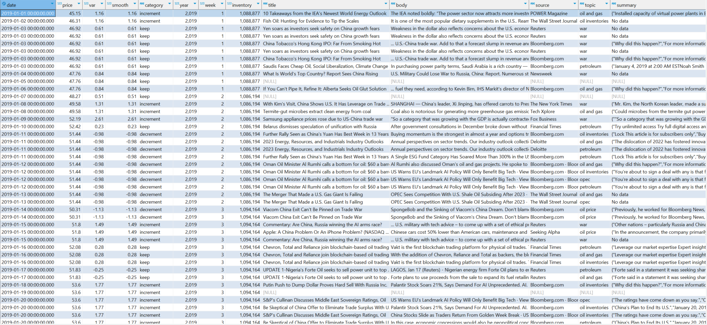

## Unveiling Trends: Exploring News Mining with Latent Dirichlet Allocation

- [Context](#context)
- [Introduction](#introduction)
   + [data exploring](lda.ipynb)
- [Data segmentation](#data-segmentation)
   + [segmentation](lda.ipynb)
- [Features](#features)
   + [building_features](lda.ipynb)
- [Preprocess](#preprocess)
   + [preprocess](lda.ipynb)
- [Findings](#findings)

## Context

*Latent Dirichlet Allocation (LDA)* stands as a highly regarded algorithm within the domain of topic modeling, serving as a pivotal tool for revealing concealed thematic frameworks across extensive document collections. This algorithm is exceptionally beneficial for tasks in natural language processing and text mining, where its capabilities in structuring, deciphering, and encapsulating vast amounts of textual data are unparalleled.

In the context of analyzing a dataset comprised of various news articles related to the oil and gas industry, including factors influencing prices such as geopolitical tensions or wars, LDA becomes instrumental. The primary objective is to distill insights and identify distinct topics that encapsulate the essence of the information presented. This approach not only aids in understanding the multifaceted impacts on the energy sector but also in forecasting potential trends and shifts within the market.

## Introduction
### Overview

*Latent Dirichlet Allocation (LDA)* is a generative statistical model that explains a set of observations through unobserved groups. In the context of text analysis, these observations are words collected into documents, and it posits that each document is a mixture of a small number of topics and that each word's presence is attributable to one of the document's topics.

### Understanding LDA

At its core, LDA is a type of unsupervised machine learning that identifies topics present in a collection of documents. It assumes that documents are produced from a mixture of topics, where each topic is characterized by a distribution over words. LDA seeks to backtrack from the documents to discover a set of topics that likely generated the collection.

### Key concepts

 - *topics:* a topic is not a label but rather a distribution over a fixed vocabulary
 - *documents:* treats each document as a mixture of topics
 - *words:* words are the basic units of observation in the dataset

### Process

 - *initialization:* specify the number of topics **K** you think exists in the corpus
 - *assigment:* LDA iteratively assigns each word in every document to a topic
 - *update:* after each word’s topic assignment, the algorithm updates the topic distribution within the document and the word distribution within topics
 - *converge:* this process repeats until reaching a steady state

## Data segmentation

Before diving into data analysis and employing the *Latent Dirichlet Allocation (LDA)* algorithm, it's crucial to meticulously curate our dataset. This step ensures the exclusion of news articles that may not align well with our core subject of interest: the oil and gas sector. Such unrelated articles could introduce noise, potentially skewing our analysis and leading to less accurate topic identification.

Our sources are reputable and varied, including industry giants and leading news outlets such as Deloitte, The New York Times, and the BBC, among others. This diverse selection ensures a comprehensive view of the topic from multiple perspectives, enhancing the robustness of our findings.

In our pursuit to refine the dataset further, we adopt a targeted approach towards content selection. Specifically, we filter news articles based on specific keywords within their titles. Words such as "oil," "gas," "war," and "Russia" act as indicators of relevance, signaling content that is likely to contribute valuable insights into our analysis. 

By doing so, we aim to concentrate on articles that are most pertinent to the oil and gas industry and its dynamics, thereby optimizing the quality and relevance of the topics generated by the *LDA model*. This preparatory step is pivotal in setting the stage for a more focused and insightful exploration of the themes and trends shaping this critical sector.

## Features

In our current dataset, each article is rich with information, encompassing elements such as brief summaries, titles, the full content of the article, and in some instances, keywords. However, for the purpose of our analysis, we are honing in on two primary components: the title and the body of the articles. This focused approach allows us to delve deeper into the topics at hand, ensuring that our analysis captures the essence of each article comprehensively.

This decision to concentrate on the title and body is driven by the goal to uncover the nuanced themes and insights that lie within the textual content. By analyzing these elements, we position ourselves to gain a more profound understanding of the subjects discussed, enabling a thorough exploration of the topics that are most relevant and impactful within the dataset. This methodical selection process is a pivotal step in our journey to extract meaningful and actionable insights from the wealth of information provided in our dataset.

## Preprocess

Prior to embarking on the Latent Dirichlet Allocation (LDA) analysis, it's essential to prepare our text data through a series of preprocessing steps. This preparation is crucial for enhancing the quality and accuracy of our topic modeling efforts. Here's an overview of the key preprocessing steps we'll undertake:

- **Cleaning the Text:** Our first step involves purging the text of any special characters and symbols. This cleanup process ensures that only meaningful textual data is retained, eliminating any extraneous elements that could distort the analysis.

- **Lemmatization:** Next, we proceed to lemmatize the tokens. Lemmatization is the process of reducing words to their base or root form. For example, "running" becomes "run". This standardization is vital for consolidating variations of a word into a single, analytical entity, thereby simplifying the complexity of the text data.

- **Finding N-Grams:** N-Grams are combinations of adjacent words or letters within the text, and they can be crucial for understanding context. For instance, the phrase "natural gas" represents a specific concept that is different from the individual meanings of "natural" and "gas". Identifying such n-grams allows us to preserve essential phrases that carry specific meanings within our dataset.

- **Filtering Out Words:** The final step involves filtering out words based on their frequency of occurrence across the documents. We exclude words that appear in fewer than 20 documents or in more than 50% of all documents. This filtering helps in removing both rare terms that add noise to the analysis and overly common terms that offer little to no distinctive value in distinguishing between topics.

By meticulously executing these preprocessing steps, we set the stage for a more effective and insightful LDA process. This approach not only streamlines our dataset but also enhances the potential for uncovering meaningful patterns and themes within the text.

## Findings

In the initial segment of our analysis, we discerned a strong emphasis on themes related to energy and the global market, a logical focus given our selection of articles from the oil and gas sector. Notably, terms like OPEC and natural gas stood out, aligning with the ongoing discourse on gas supply issues in Europe over the past two years. Additionally, subjects such as Russia, price fluctuations, and China's role in the energy market were prominent, reflecting the broader implications of the Ukraine-Russia conflict. This geopolitical strife has notably led to oil prices surging to near $120, underscoring the interconnectedness of global events and energy markets.

Another intriguing aspect that emerged was the mention of artificial intelligence within our dataset. This suggests the onset of a pivotal shift towards the energy transition, aimed at mitigating climate change effects, or possibly advancements in upstream sector operations. The inclusion of artificial intelligence topics prompts a deeper exploration to fully grasp its potential impacts on the energy sector. This analysis hints at a broader narrative encompassing energy supply dynamics, geopolitical tensions, market responses, and the innovative strides towards sustainability and efficiency within the industry.

Continuing our exploration of topics covered by *Seeking Alpha*, we find that the themes closely mirror the ongoing dynamics within the oil and gas sector, particularly highlighting the tensions between Ukraine and Russia. These geopolitical tensions have led to significant disruptions in natural gas supplies, a critical issue that deserves attention. Notably, in alignment with the site's content focus, we also observe discussions around corporate strategy and financial dealings. These discussions hint at the impact of COVID-19 on specific companies, underlining the pandemic's extensive influence on the sector.

Moreover, the analysis points to a compelling narrative where Russia, China, and Europe are key players shaping the international market. This influence extends beyond the sanctions imposed by the United States, suggesting a shift in the factors that traditionally impacted oil prices, such as OPEC meetings. Looking ahead, it's essential to consider how geopolitical conflicts in the Middle East and other regions could further affect the market. Specifically, the gas supply dynamics between Russia and China, along with China's industrial development, emerge as critical areas for future analysis. These elements collectively underscore the complex interplay of global politics, market strategies, and energy supply chains, driving the oil and gas sector's evolving landscape.

## Conclusions

Latent Dirichlet Allocation (LDA) proves to be a robust algorithm for topic modeling, adept at uncovering thematic structures within vast collections of documents. In our exploration, the primary goal was to derive insights from recent news pertaining to the oil and gas sector. This analysis brought to light several key insights, notably identifying Russia, China, and Europe as the pivotal players in the current landscape. Interestingly, there was a scarce mention of the Middle East. Without prior knowledge of the sector, one could deduce that geopolitical conflicts and the COVID-19 pandemic have been significant drivers of oil and gas market fluctuations and price increases over the last year.

To further enrich our conclusions and provide a more comprehensive perspective, it's essential to understand why news narratives have centered around Russia. Historically, Russia has been a major natural gas supplier to Europe, with most pipelines traversing Ukraine. These pipelines are not only critical for Europe's energy supply but also serve as a significant revenue source for Ukraine. Additionally, the growing energy demands of China, which has heavily relied on coal, spotlight Russia and, to an extent, Kazakhstan as key energy suppliers. This dynamic underscores the intricate relationships and dependencies within the global energy market.

Given this context, we can identify several factors influencing oil and gas prices. For instance, the COVID-19 pandemic led to a notable decline in oil benchmarks, resulting in historically low gasoline prices in countries like the United States and Mexico. Conversely, geopolitical tensions and conflicts tend to push prices upward, affecting stock markets and investor sentiment. This analysis not only sheds light on the immediate factors affecting oil and gas prices but also highlights the broader geopolitical and economic influences shaping the sector's future.
